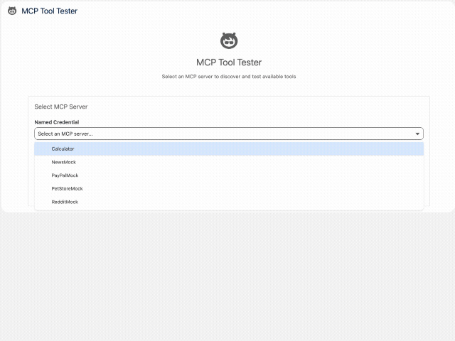

# MCP Workbench

A Salesforce Lightning application for testing and validating MCP (Model Context Protocol) servers and tools before configuring them in Agentforce. Workbench allows you to:

- **Connect** to MCP servers via Named Credentials
- **Discover** available tools and their schemas
- **Test** tools with custom parameters through a dynamic UI
- **Validate** responses before deploying to Agentforce agents
- **Debug** connection issues with detailed error messages

## Contents

- [MCP Workbench](#mcp-workbench)
  - [Contents](#contents)
  - [Installation](#installation)
    - [Prerequisites](#prerequisites)
    - [Step 1: Deploy the Code](#step-1-deploy-the-code)
      - [Non-Namespaced Orgs](#non-namespaced-orgs)
      - [Namespaced Orgs](#namespaced-orgs)
    - [Step 2: Assign the Permission Set](#step-2-assign-the-permission-set)
  - [Use MCP Workbench](#use-mcp-workbench)
    - [Step 1: Open the App](#step-1-open-the-app)
    - [Step 2: Select an MCP Server](#step-2-select-an-mcp-server)
    - [Permissions Diagnostic](#permissions-diagnostic)
    - [Step 3: Browse Available Tools](#step-3-browse-available-tools)
    - [Step 4: Test a Tool](#step-4-test-a-tool)
      - [Left Column: Input Parameters](#left-column-input-parameters)
      - [Right Column: Response](#right-column-response)
    - [Step 5: Iterate and Validate](#step-5-iterate-and-validate)
  - [Registering an MCP Server](#registering-an-mcp-server)
    - [Agentforce Registry](#agentforce-registry)
  - [Technical Componentry](#technical-componentry)
    - [Lightning Web Component: `mcpToolTester`](#lightning-web-component-mcptooltester)
    - [Apex Class: `McpToolTester`](#apex-class-mcptooltester)
    - [MCP Session Management (2025-06-18)](#mcp-session-management-2025-06-18)
    - [Lightning App: `MCP Workbench`](#lightning-app-mcp-workbench)
    - [Permission Set: `MCP_Workbench`](#permission-set-mcp_workbench)
  - [Error Handling](#error-handling)
    - [Error Display](#error-display)
  - [Contributing](#contributing)
  - [License](#license)

## Installation

### Prerequisites

- Salesforce CLI `sf` installed
- Connected to a Salesforce org (sandbox or scratch org recommended) **with MCP Beta Permissions Enabled**
- One or more MCP servers registered via Agentforce Registry. Registration steps at: [Register MCP Server](#registering-an-mcp-server)

### Step 1: Deploy the Code

#### Non-Namespaced Orgs

`sf package install -p 04tHs000000iSeWIAU -o {TARGET}`

#### Namespaced Orgs

Clone repo:
`git clone git@github.com:mvogelgesang/MCP-Workbench.git`

Open project
`cd mcpWorkbench`

Deploy all components to your org
`sf project deploy start --source-dir force-app/main/default`

**What gets deployed:**

- Apex class (`McpToolTester`) and test classes
- Content Asset (MCP Logo)
- Lightning app (`MCP_Workbench`)
- Lightning Web Component (`mcpToolTester`)
- Tab (`MCP Workbench`)
- Permission set

### Step 2: Assign the Permission Set

`sf org assign permset --name MCP_Workbench`

## Use MCP Workbench

### Step 1: Open the App

1. Click the App Launcher (waffle icon) in the top-left
2. Search for **"MCP Workbench"**
3. Click to open

You should see the **MCP Workbench** tab.

### Step 2: Select an MCP Server

1. From the dropdown, select your Named Credential API name
2. Click **"Connect to Server"**

**What happens:**

- Sends an MCP `initialize` request
- Displays server info (name, version, protocol)
- Loads available tools automatically
- Runs a read-only **Permissions Diagnostic** (see below)
- If issues exist, errors are reported on the page

### Permissions Diagnostic

After a successful Connect, MCP Workbench renders a collapsible **Permissions Diagnostic** panel between **Server Connection Details** and **Available Tools**. It is read-only — nothing is granted or assigned — and is designed to catch the two most common reasons MCP traffic fails for ISV partners:

1. **External Credential access (heuristic)** — `ExternalCredential` and its Principal are not directly queryable from Apex SOQL, so the diagnostic infers access from `SetupEntityAccess` rows of type `ExternalCredentialParameter`. A user who has any Permission Set granting `ExternalCredentialParameter` access is very likely to also have the principal access for this MCP. This is a strong indicator, not a guarantee — the diagnostic cannot tie a specific principal to the specific MCP you selected.
2. **`UserExternalCredential` Read** — verified exactly via `ObjectPermissions`. The user must have Read on the `UserExternalCredential` sObject so Salesforce can resolve their per-user OAuth token at runtime.

The panel runs both checks for each of:

- The **current user** (the admin configuring the MCP)
- Every active user whose `Name` starts with `Platform` — typically the Salesforce-managed **Platform Integration User** that Agentforce/MCP runs as at execution time
- Optionally, any **specific Username** you enter in the "Also check a specific Username" input

Each row shows pass / fail icons for the two checks, the Permission Set(s) currently carrying the access (when any), and a remediation hint when access is missing. To re-run after assigning a Permission Set, click **Run** in the panel.

If the running user lacks "View Setup and Configuration", the panel surfaces an inline warning explaining that setup-object queries failed; the rest of MCP Workbench continues to function.

### Step 3: Browse Available Tools

After connection, you'll see tool cards with:

- **Tool name** (e.g., "getPet", "addPet")
- **Description** (what the tool does)
- **Click to test**

Click any tool card to open the testing interface.

### Step 4: Test a Tool

The testing view has two columns:

#### Left Column: Input Parameters

- **Dynamic form** generated from the tool's input schema
- **Required fields** marked with `*`
- **Array fields** with Add/Remove item buttons
- **Field descriptions** for guidance
- **Input Schema** display (JSON)

#### Right Column: Response

- **JSON response** from the tool execution
- **Formatted display** with syntax highlighting
- **Error messages** if execution fails

**To test:**

1. Fill in required parameters
2. Add optional parameters as needed
3. For Tool inputs requiring an array, click **"Add Item"** to add entries
4. Click **"Execute Tool"**
5. Review the response on the right

### Step 5: Iterate and Validate

- Modify parameters and re-execute
- Test different input combinations
- Verify error handling with invalid inputs
- Document expected responses for Agentforce configuration

## Registering an MCP Server

Before you can test tools, you need to register your MCP server via Agentforce Registry.

### Agentforce Registry

1. **Setup → Agentforce Registry → New**
2. Configure:
   - **MCP Server Name**: Your server name (e.g., "PetStore")
   - **Description**: What does the MCP server do?
   - **Server URL**: URL of remote MCP Server
   - **Authentication Method**: {pick appropriate auth method}
   - **Identity Provider URL**: Your MCP server's OAuth token URL
   - **Scope**: Required OAuth scopes (if any)
   - **Client ID**: Your OAuth client ID
   - **Client Secret**: Your OAuth client secret
3. Click **Create & Continue**
4. Add one or more Tools, click **Allow and Continue**
5. Click Save on Apply Policies page.

## Technical Componentry

### Lightning Web Component: `mcpToolTester`

Interactive UI with three views:

1. **Server Selection** - Choose and connect to MCP servers
2. **Tools List** - Browse available tools as clickable cards
3. **Tool Testing** - Test individual tools with dynamically generated forms

**Location**: `force-app/main/default/lwc/mcpToolTester/`

### Apex Class: `McpToolTester`

Backend controller that handles MCP protocol communication. All MCP HTTP entrypoints below return an `McpResponse` wrapper (`body`, `statusCode`, `sessionId`, `sessionExpired`) so the LWC can manage the MCP session lifecycle described in [MCP Session Management](#mcp-session-management-2025-06-18).

- `initializeConnection(namedCredential)` - Connect to MCP server; captures the server's `Mcp-Session-Id`.
- `sendInitializedNotification(namedCredential, sessionId, protocolVersion)` - Fire the spec-required `notifications/initialized` JSON-RPC notification after a successful initialize.
- `getAvailableTools(namedCredential, sessionId, protocolVersion)` - List available tools.
- `getAvailableResources(namedCredential, sessionId, protocolVersion)` - List available MCP resources.
- `callTool(namedCredential, toolName, parameters, sessionId, protocolVersion)` - Execute a tool.
- `terminateSession(namedCredential, sessionId)` - Best-effort HTTP DELETE that releases the session server-side. Tolerates 405 Method Not Allowed.
- `runPermissionsDiagnostic(namedCredential, additionalUsername)` - Read-only permissions diagnostic (see [Permissions Diagnostic](#permissions-diagnostic)).
- `callMcpServer(namedCredential, requestBody)` - Legacy String-returning entrypoint retained for backward compatibility; new code should use the methods above.
- `getAvailableServers()` - List Named Credentials.

**Location**: `force-app/main/default/classes/McpToolTester.cls`

### MCP Session Management (2025-06-18)

MCP Workbench implements the Streamable HTTP session management contract from the [MCP 2025-06-18 spec](https://modelcontextprotocol.io/specification/2025-06-18/basic/transports#session-management):

1. **Session capture**: when the server returns an `Mcp-Session-Id` header on the `InitializeResponse`, the LWC stores it for the lifetime of the connection.
2. **Header propagation**: every subsequent request (tool calls, list calls, the `notifications/initialized` notification, and the DELETE) carries that `Mcp-Session-Id` header, plus the negotiated `MCP-Protocol-Version` header.
3. **Initialized notification**: immediately after a successful initialize, the workbench fires `notifications/initialized` (the spec-required handshake completion).
4. **Server-initiated expiry**: if the server responds with HTTP 404 to a request carrying the workbench's session ID, the Apex side flags `sessionExpired: true` on the structured error payload and the LWC transparently re-initializes a new session before retrying the original action.
5. **Explicit termination**: the LWC sends a best-effort HTTP DELETE with `Mcp-Session-Id` when the user navigates back to server selection, switches Named Credentials, or closes the workbench tab. Servers that respond 405 Method Not Allowed are tolerated gracefully.
6. **Servers without sessions**: when the server omits `Mcp-Session-Id`, the workbench treats the connection as stateless — no session header is sent on subsequent calls, and DELETE is skipped.

### Lightning App: `MCP Workbench`

Dedicated app with the tool tester component embedded in a tab.

**Location**: `force-app/main/default/applications/MCP_Workbench.app-meta.xml`

### Permission Set: `MCP_Workbench`

Grants access to the app and Apex classes.

**Location**: `force-app/main/default/permissionsets/MCP_Workbench.permissionset-meta.xml`

## Error Handling

The tool tester provides detailed error diagnostics.

### Error Display

When errors occur, you'll see:

1. **Error banner** with summary message
2. **"Show Details"** button to expand full error information
3. **Troubleshooting guide** with specific steps
4. **Technical details** (JSON) for debugging

## Contributing

Found a bug? Have a feature request?

1. Open an issue describing the problem/feature
2. If fixing a bug, include debug logs and steps to reproduce
3. For features, describe the use case and expected behavior

Pull requests welcome! See [CONTRIBUTING.md](CONTRIBUTING.md) for guidelines.

## License

This project is licensed under the Apache License 2.0 - see the [LICENSE](LICENSE) file for details.

Copyright (c) 2024 Salesforce, Inc.
